> [!NOTE]
> The vendor was notified of these vulnerabilities and provided with a detailed report prior to publication. No response had been received at the time of publication.

# Static analysis of Ironshield anti-cheat

Game studios are building their own anti-cheat solutions to better address the needs of their games and respond more quickly to cheating. A high-quality third-party solution gives studios access to mature detection mechanisms without having to develop them from scratch. However, relying on an external vendor can make it harder to tailor the anti-cheat to a game’s specific needs or respond to cheating as quickly as the studio would like. Bringing development in-house gives studios direct control over what they build and when they deploy it, allowing them to tailor countermeasures to their games and adapt more quickly as cheating techniques evolve[^nc][^eaac][^epic].

As more studios develop their own anti-cheat systems, some of that work can fall to developers with limited experience in systems programming and security. This is particularly risky when kernel-mode drivers are involved, as inappropriate implementation can introduce vulnerabilities that leave players’ systems open to attack[^mhyprot2].

Previously, I shared a work on devirtualizing Zakynthos, PUBG’s anti-cheat, and the Tencent VM from AntiCheatExpert. I have now statically devirtualized every virtualized function in Ironshield’s kernel-mode driver `tvk.sys`. In this article, I examine the driver’s implementation and discuss the vulnerabilities I found during my analysis.

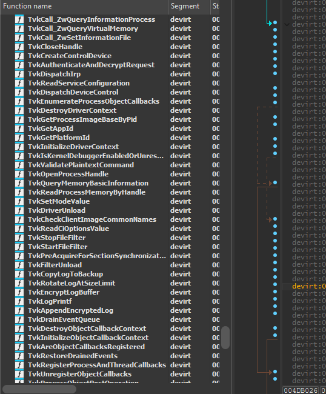

[^nc]: https://about.ncsoft.com/news/article/technology-push-the-boundaries-6
[^eaac]: https://www.ea.com/security/news/eaac-deep-dive
[^epic]: https://onlineservices.epicgames.com/news/epic-online-services-launches-two-new-free-services
[^mhyprot2]: https://www.trendmicro.com/en_us/research/22/h/ransomware-actor-abuses-genshin-impact-anti-cheat-driver-to-kill-antivirus.html

# IOCTL

During my analysis, I found several vulnerabilities in the driver that could cause LPE.

The driver encrypts its IOCTL payloads with LEA cipher [^lea], and clients trying to connect to the driver will be checked on `IRP_MJ_CREATE` for their authority. However, it only checks if `"IRONMACE Co., Ltd."` and `"DigiCert Trusted Root G4"` strings appear in the `WIN_CERTIFICATE` buffer and never parses and validates PKCS blob, so an attacker can simply craft a self-signed certificate containing the strings to bypass the check to gain a full access to the IOCTL.

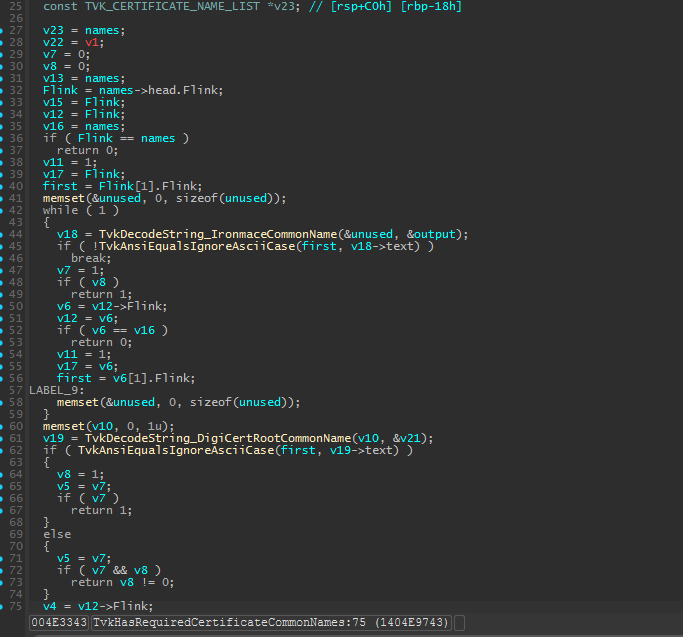

In order to correctly implement this, I highly recommend using `CI.dll` exports such as `CiCheckSignedFile`, `CiValidateFileObject` and `CiGetCertPublisherName`. However, an attacker can still run their code on the hijacked legitimate process.

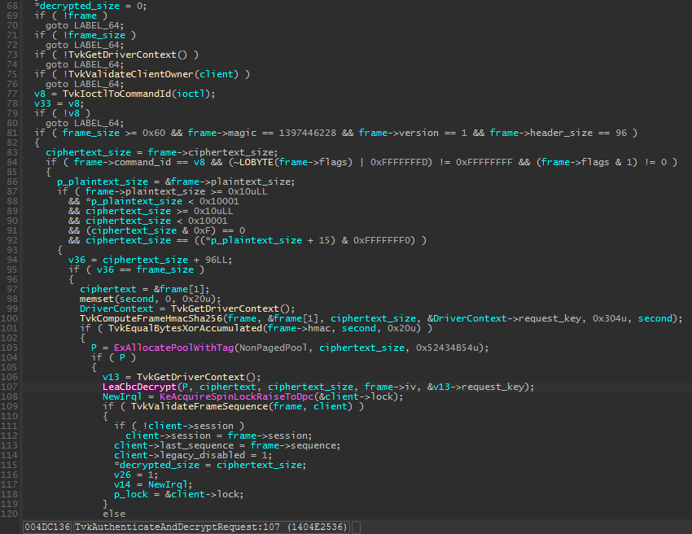

The LEA key is statically visible on the code (devirtualized), which can always be derived to the same key.

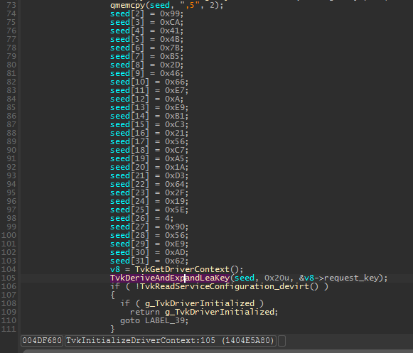
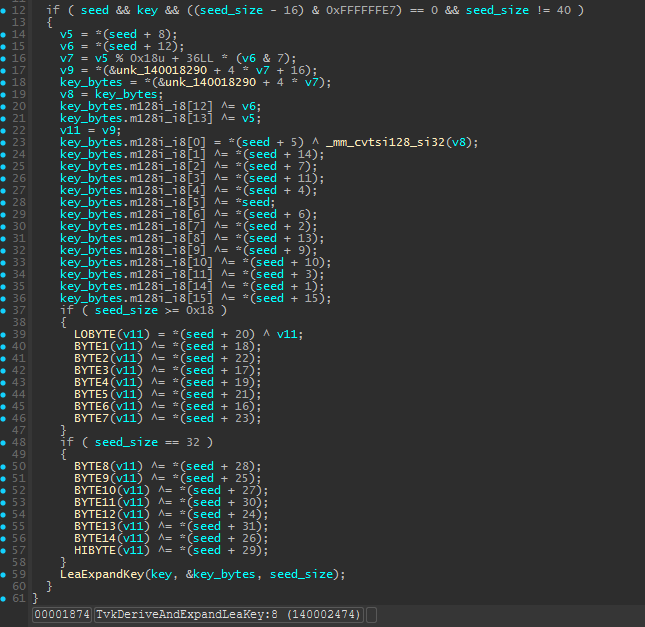

Additionally, every IOCTL request validates requesting process by performing a check to ensure it matches the process on the context.

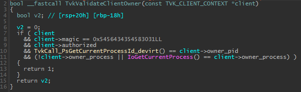

Finally, this is the full list of IOCTL commands can be performed, which requires no admin rights and no debug privilege.

This includes:

* Limited kernel reads via client-supplied symbol offsets (for querying `g_CiOptions`)
* Arbitrary process handle (including kernel handles)
* Arbitrary process virtual memory read/write/query (can also query base address via `PsGetProcessSectionBaseAddress`)
* Kernel pointer leaks (object pre/post callback pointers)

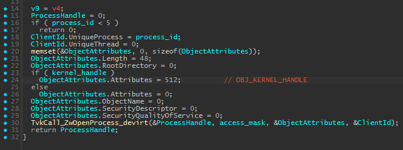

```c
#define IOCTL_TVK_POLICY CTL_CODE(FILE_DEVICE_UNKNOWN, 0x831, METHOD_BUFFERED, FILE_READ_ACCESS | FILE_WRITE_ACCESS)
#define IOCTL_TVK_PATH_RULE CTL_CODE(FILE_DEVICE_UNKNOWN, 0x840, METHOD_BUFFERED, FILE_READ_ACCESS | FILE_WRITE_ACCESS)
#define IOCTL_TVK_PROCESS_RULE CTL_CODE(FILE_DEVICE_UNKNOWN, 0x841, METHOD_BUFFERED, FILE_READ_ACCESS | FILE_WRITE_ACCESS)
#define IOCTL_TVK_SYMBOL CTL_CODE(FILE_DEVICE_UNKNOWN, 0x842, METHOD_BUFFERED, FILE_READ_ACCESS | FILE_WRITE_ACCESS)
#define IOCTL_TVK_OPEN_PROCESS CTL_CODE(FILE_DEVICE_UNKNOWN, 0x843, METHOD_BUFFERED, FILE_READ_ACCESS | FILE_WRITE_ACCESS)
#define IOCTL_TVK_MODE CTL_CODE(FILE_DEVICE_UNKNOWN, 0x832, METHOD_BUFFERED, FILE_READ_ACCESS | FILE_WRITE_ACCESS)
#define IOCTL_TVK_OPEN_PROCESS_KERNEL CTL_CODE(FILE_DEVICE_UNKNOWN, 0x844, METHOD_BUFFERED, FILE_READ_ACCESS | FILE_WRITE_ACCESS)
#define IOCTL_TVK_CLOSE_HANDLE CTL_CODE(FILE_DEVICE_UNKNOWN, 0x845, METHOD_BUFFERED, FILE_READ_ACCESS | FILE_WRITE_ACCESS)
#define IOCTL_TVK_QUERY_MEMORY CTL_CODE(FILE_DEVICE_UNKNOWN, 0x846, METHOD_BUFFERED, FILE_READ_ACCESS | FILE_WRITE_ACCESS)
#define IOCTL_TVK_READ_MEMORY CTL_CODE(FILE_DEVICE_UNKNOWN, 0x847, METHOD_BUFFERED, FILE_READ_ACCESS | FILE_WRITE_ACCESS)
#define IOCTL_TVK_IMAGE_BASE CTL_CODE(FILE_DEVICE_UNKNOWN, 0x848, METHOD_BUFFERED, FILE_READ_ACCESS | FILE_WRITE_ACCESS)
#define IOCTL_TVK_CI_OPTIONS CTL_CODE(FILE_DEVICE_UNKNOWN, 0x849, METHOD_BUFFERED, FILE_READ_ACCESS | FILE_WRITE_ACCESS)
#define IOCTL_TVK_CALLBACKS CTL_CODE(FILE_DEVICE_UNKNOWN, 0x84A, METHOD_BUFFERED, FILE_READ_ACCESS | FILE_WRITE_ACCESS)
#define IOCTL_TVK_CREATE_EVENT CTL_CODE(FILE_DEVICE_UNKNOWN, 0x84B, METHOD_BUFFERED, FILE_READ_ACCESS | FILE_WRITE_ACCESS)
#define IOCTL_TVK_EVENTS CTL_CODE(FILE_DEVICE_UNKNOWN, 0x84C, METHOD_BUFFERED, FILE_READ_ACCESS | FILE_WRITE_ACCESS)
```

[^lea]: https://github.com/enoma422/LEA-256/blob/ddb024e488c795e76211baed81ef8ca977d05779/LEA_C/lea.c

# Service configuration

During initialization, the driver extracts its service name from the registry path passed to its driver entry and reads the `Platform` and `App` (`DWORD`) values from its driver service registry key. It uses `RtlQueryRegistryValuesEx` when available, `RtlQueryRegistryValues` otherwise. Initialization fails if either value cannot be read or falls outside the accepted range.

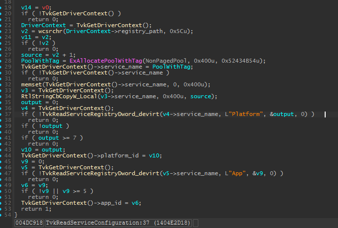

In this sample, `Platform` must be between `1` and `6`. The accepted range for App is `1`–`4` in version `1.0.0.165` and `1`–`7` in the September 17 build (`1.0.0.167`).

The validated IDs are stored in the driver context and later used to construct named event names and object callback altitudes. The service name is used to construct the device and symbolic link names.

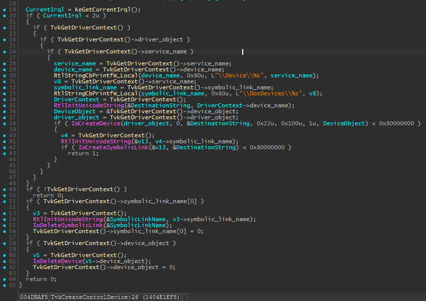

# Dynamic kernel symbol offsets

Offsets for internal kernel structures and symbols can vary between Windows builds. Drivers often handle these differences by hardcoding offsets and selecting the appropriate values through version-specific branches, which are often very error-prone.

This driver takes a different approach. The driver maintains a list of symbol name hashes and offsets supplied by the user-mode client through IOCTL. Each entry contains a 64-bit FNV1a hash and a 64-bit offset. List nodes are allocated from a lookaside list.

To retrieve an offset, the driver hashes the requested name and searches the list for the first matching entry. The lookup returns `0` if no match is found.

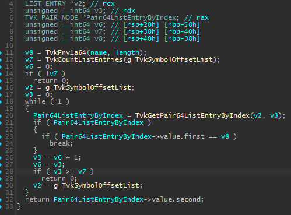

The table is used to locate `g_CiOptions` relative to the loaded base address of `CI.dll` and to obtain the member offset of `_OBJECT_TYPE::CallbackList`. If no offset is registered for CallbackList, the callback enumeration routine falls back to `0xC8`. The `g_CiOptions` query fails if its offset is unavailable.

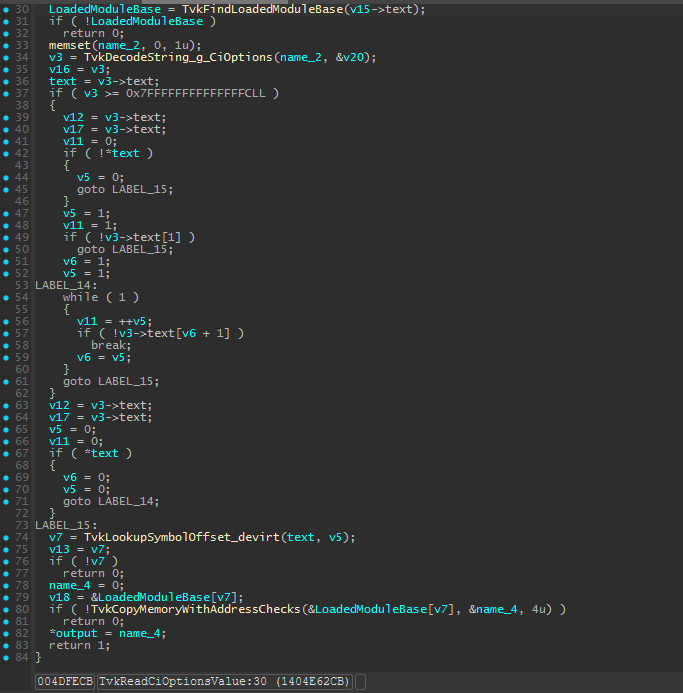
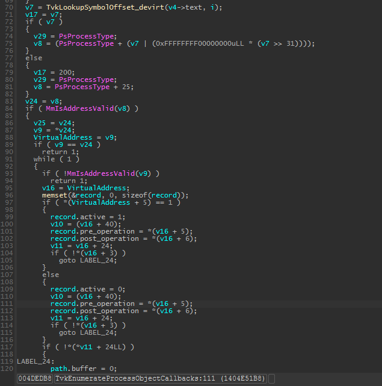

This client-supplied symbol offset for `g_CiOptions` allows reading of limited (but still wide enough) range of kernel virtual memory. There is no check on whether if the address run out of `CI.dll` image bounds so anything below the `CI.dll` base can be read.

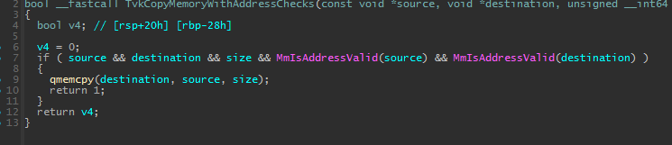

# String encoding

The driver encodes selected strings on stack, including API and module names, using a common XOR-based encoding. Each string is decoded using a hardcoded 32-bit seed. Decode routines XORs each byte or UTF-16 code unit with the low 8 or 16 bits of the current state, respectively, then updates the state as `state = 0xBC8F * state % 0x3832C5A6`. These decoding routines are not virtualized.

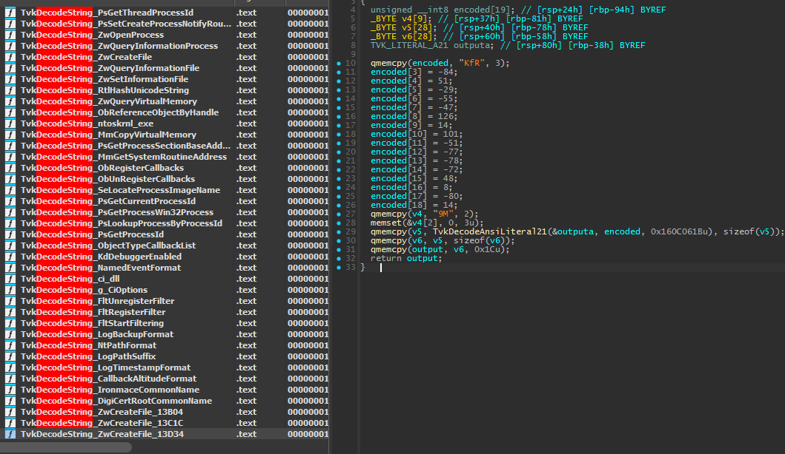

# Anti-Debug check

The driver performs a single anti-debugging check by reading `KdDebuggerEnabled`. This check is performed only during driver initialization.

I did not find any anti-VM or anti-hypervisor checks in the driver.

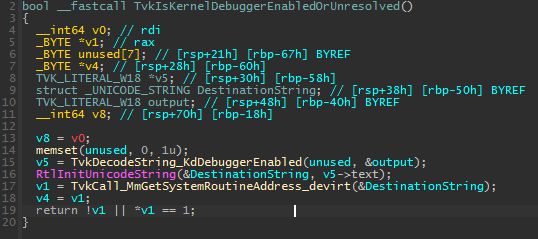

# Dynamic API table

Although most APIs used by the driver are listed in its PE import table, some are resolved dynamically during driver initialization.

* `MmGetSystemRoutineAddress` 
* `ObRegisterCallbacks` 
* `ObUnRegisterCallbacks` 
* `SeLocateProcessImageName` 
* `PsGetCurrentProcessId` 
* `PsGetProcessWin32Process` 
* `PsLookupProcessByProcessId` 
* `PsGetProcessId` 
* `PsGetThreadProcessId` 
* `PsSetCreateProcessNotifyRoutineEx` 
* `ZwOpenProcess` 
* `ZwQueryInformationProcess` 
* `ZwCreateFile` 
* `ZwQueryInformationFile` 
* `ZwSetInformationFile` 
* `RtlHashUnicodeString` 
* `ZwQueryVirtualMemory` 
* `ObReferenceObjectByHandle` 
* `MmCopyVirtualMemory` 
* `PsGetProcessSectionBaseAddress` 

The base address of ntoskrnl.exe is obtained using `ZwQuerySystemInformation(SystemModuleInformation)`, and the export table in its on-disk image is parsed manually.

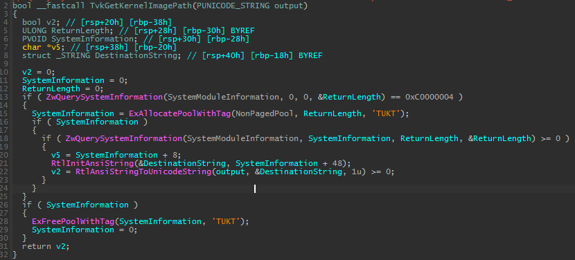
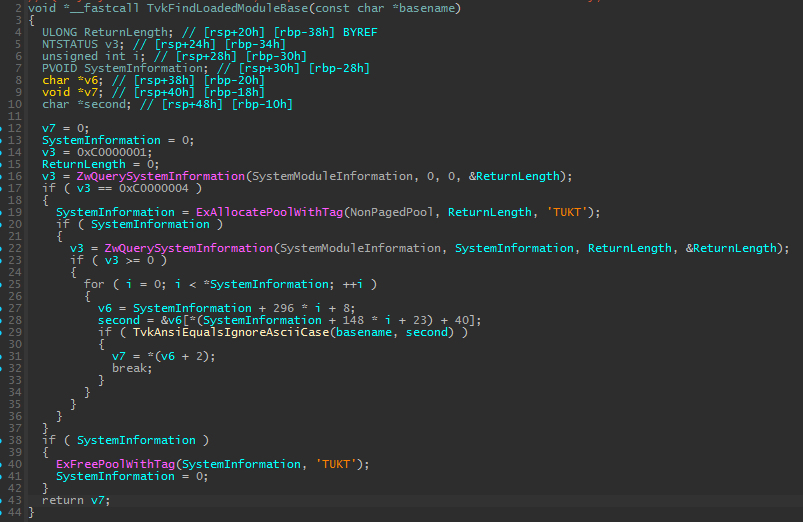

The API table is implemented as a linked list, with entries allocated from a lookaside list[^lookaside]. Entries are looked up by their `api_id`.

```c
struct TVK_API_ENTRY {
  uint32_t api_id;
  void *address;
  LIST_ENTRY links;
};
```

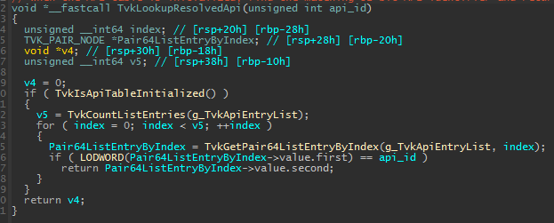

[^lookaside]: https://learn.microsoft.com/en-us/windows-hardware/drivers/kernel/using-lookaside-lists

# Process management

The driver registers a process notification routine using `PsSetCreateProcessNotifyRoutineEx`. On process creation, the callback computes a case-insensitive hash of the process image path and caches nonzero results in an AVL table[^avl] keyed by PID. The corresponding entry is removed when the process exits. The driver does not enumerate existing processes during initialization. However, their image-path hashes can be computed and cached on demand when a subsequent path-rule check encounters a cache miss.

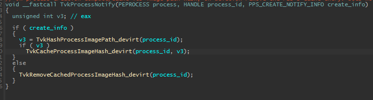
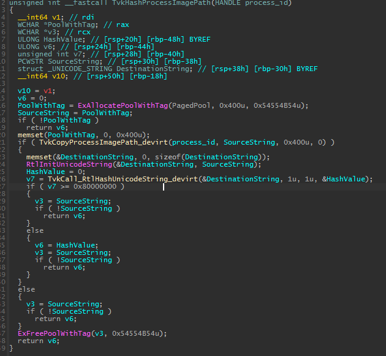
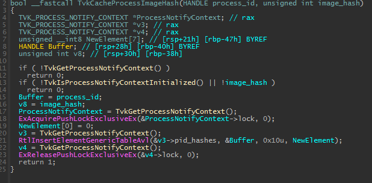

[^avl]: https://learn.microsoft.com/en-us/windows-hardware/drivers/ddi/ntddk/ns-ntddk-_rtl_avl_table

# Policy management

The process cache described above is used when evaluating the driver’s protection rules. A user-mode client configures the driver through separate IOCTL requests for setting policy values, adding path rules, and adding allowed PID pairs. Policy values control filtering behavior, while rule categories define the targets and exceptions.

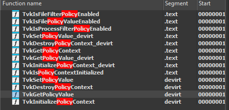
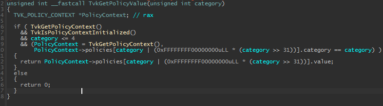

Policy IDs and rule category IDs have separate meanings, path-based rules are stored as case-insensitive, 32-bit hashes computed using `RtlHashUnicodeString`. Allowed PID pairs are stored as ordered source and target pairs. Rule entries are maintained in linked lists and allocated from lookaside lists. The following rule categories are used.

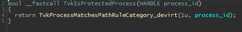
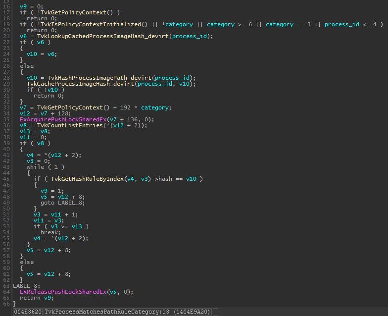

| Policy | Description                                                                                         |
| ------ | --------------------------------------------------------------------------------------------------- |
| 0      | Controls registration and removal of the process and thread object callbacks.                       |
| 1      | Unknown                                                                                             |
| 2      | Unknown                                                                                             |
| 3      | Selects DLL filtering behavior, including blocking, nonblocking, and disabled modes.                |
| 4      | Participates in the minifilter enable check. DLL filtering still requires an active policy 3 value. |

| Category | Description                                    |
| -------- | ---------------------------------------------- |
| 1        | Hashes of protected processes                  |
| 2        | Hashes of callers exempt from handle filtering |
| 3        | Allowed source-to-target PID pairs             |
| 4        | Hashes of processes subject to DLL filtering   |
| 5        | DLL path hashes checked by the minifilter      |

# Object management

The policy `0` controls the registration of process and thread object callbacks. During handle creation or duplication, these callbacks consult rule categories 1-3 to identify protected targets and applicable exceptions.

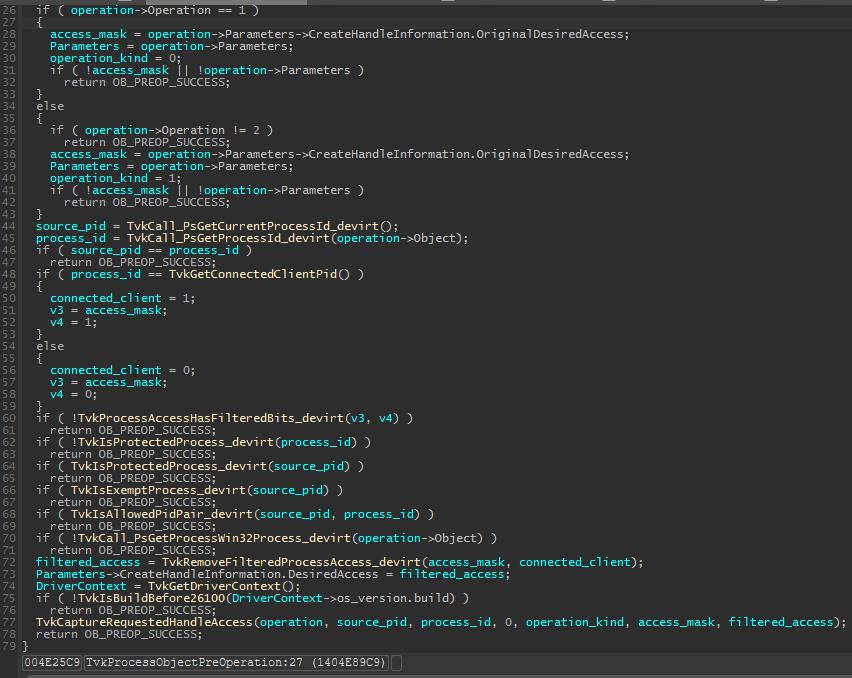
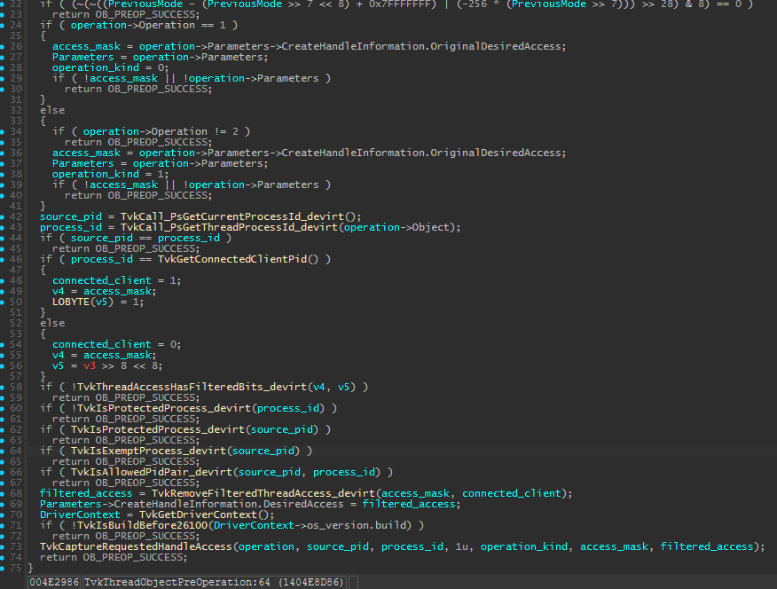

Calls from protected or exempt processes, as well as explicitly allowed PID pairs, are excluded from filtering. When the filtering conditions are met, the callbacks strips accesses from the handle.

# Minifilter

Policy `3` controls DLL filtering through a minifilter. During executable section creation (well known as `IRP_MJ_ACQUIRE_FOR_SECTION_SYNCHRONIZATION`), the filter checks whether the current process matches rule category `4` and whether the file has a `.dll` extension and a path hash matching category `5`.

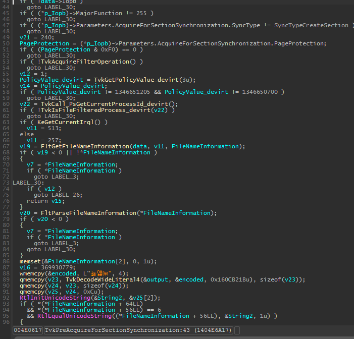
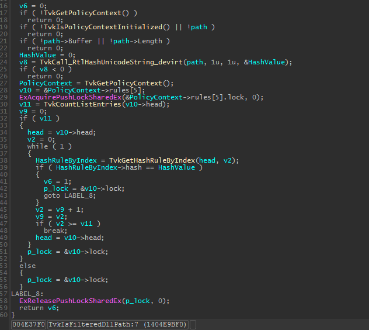

With policy value `0x5044424C`, matching requests are completed with `STATUS_ACCESS_DENIED`. The alternative active value, `0x50444445`, performs the checks without denying the operation.

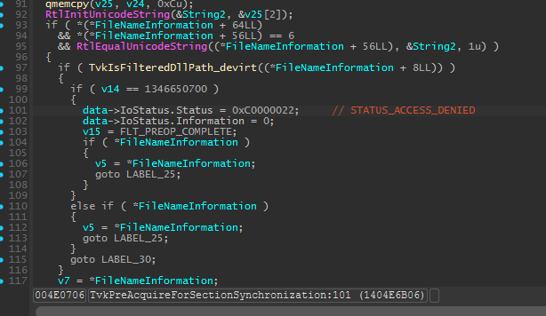

# Log encryption

The driver implements its own custom logging that is saved on disk in encrypted form. The log writer constructs a destination path of the form `\??\<base path>\Tavern\tvk.bin`. File writes are performed only when the `g_TvkLoggingInitialized` is set and the current IRQL is `PASSIVE_LEVEL`.

However, I did not identify the initialization of the `g_TvkLoggingInitialized`, the path buffer, or log key within the analyzed binary so they are mostly and practically dead code.

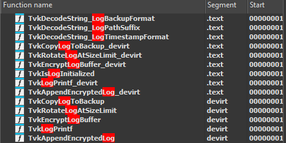
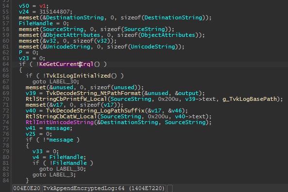

The logger formats each message in a 256-byte ANSI buffer and converts it to UTF-16. A local-time timestamp and the message are encrypted separately using LEA-CBC. Each plaintext includes its nul terminator and is zero-aligned to a 16-byte. Both encryptions use the same hardcoded IV (initial vector) and a LEA key dedicated to logging.

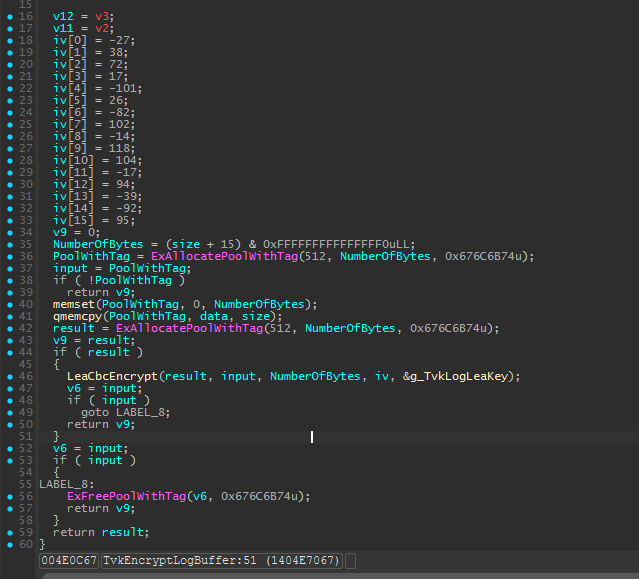

Each encrypted record is prefixed with a four-byte, little-endian value containing the ciphertext length XOR'd with `0x12C8BA67`. A log entry therefore consists of a timestamp record followed by a message record. The records are appended using `ZwWriteFile`.

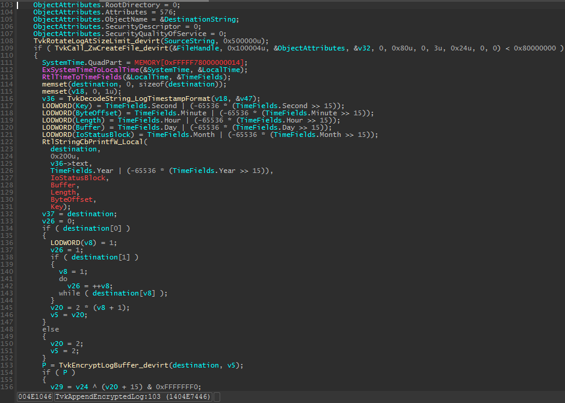

Before appending, the writer checks whether the existing log has reached 5 MiB. If so, it attempts to copy the file to tvk.bin.001 and then deletes the original.

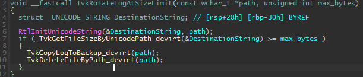

# Conclusion

Although frontier AI cannot yet reliably deobfuscate complex binaries on its own, its rapid progress is revealing which obfuscation genuinely resist automated deobfuscation and which merely look complex.

By sharing my devirtualization work, I hope to raise the bar for software obfuscation and contribute to a more informed discussion of what works and what does not. I expect these efforts to help shift the field’s focus from how complex obfuscated code appears to how well it withstands deobfuscation in practice.

I will continue this work and share what I learn along the way.
